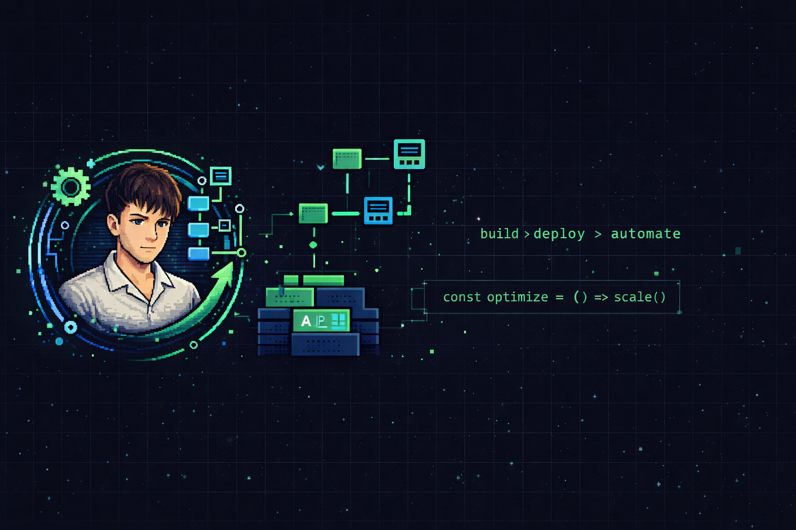

<p align="center">
  
</p>

<h1 align="center">GalfreDev Web</h1>

<p align="center">
  Landing profesional de servicios de automatización, software a medida e IA aplicada a negocios.<br/>
  Construida para convertir, capturar leads con contexto y escalar hacia seguimiento comercial.
</p>

<p align="center">
  
  
  
  
  
  
</p>

---

## Objetivo

Sitio web comercial de [GalfreDev](https://galfredev.com) orientado a:

- Presentar la propuesta de valor con foco en resultados concretos para negocios
- Derivar la conversación a WhatsApp o a un diagnóstico guiado
- Capturar leads con validación, sanitización y consentimiento explícito (LGPD-ready)
- Ofrecer acceso liviano con magic link y OAuth via Supabase Auth
- Dejar una base lista para crecer hacia seguimiento comercial y automatizaciones

---

## Stack

| Capa | Tecnología |
|---|---|
| Framework | Next.js 16 (App Router) |
| UI | React 19 + Tailwind CSS v4 |
| Animaciones | Framer Motion v12 |
| Auth + DB | Supabase (SSR) |
| Tipado | TypeScript 5 (strict) |
| Analítica | Vercel Analytics + Speed Insights |
| Deploy | Vercel |

---

## Estructura del proyecto

```
src/
├── app/                   # Rutas, páginas, API routes y metadata
│   ├── api/lead/          # Endpoint de captación de leads
│   ├── api/profile/       # Endpoint de actualización de perfil
│   ├── auth/              # Callbacks de autenticación
│   ├── login/             # Página de acceso
│   └── perfil/            # Página de perfil de usuario
├── components/
│   ├── sections/          # Secciones de la landing (Hero, Solutions, Process, ROI, Founder, Contact)
│   ├── motion/            # Wrappers de animación reutilizables
│   ├── ui/                # Componentes de interfaz genéricos
│   ├── layout/            # Header, Footer, FAB de WhatsApp
│   ├── auth/              # Panel de login
│   └── profile/           # Formulario y uploader de avatar
├── content/               # Contenido editable: copy, secciones, navegación
├── lib/                   # Utilidades, validaciones, Supabase, seguridad, whatsapp
└── types/                 # Tipos globales del dominio
data/
├── schema.sql             # Esquema base de Supabase
└── migrations/            # Migraciones SQL aditivas y seguras
```

---

## Desarrollo local

```bash
# 1. Clonar el repo
git clone https://github.com/galfredev/galfredev-web.git
cd galfredev-web

# 2. Instalar dependencias
npm install

# 3. Configurar variables de entorno
cp .env.example .env.local
# Completar con tus credenciales de Supabase

# 4. Levantar el servidor
npm run dev
```

Abrí [http://localhost:3000](http://localhost:3000).

---

## Variables de entorno

Tomá `.env.example` como base. Variables requeridas:

```env
NEXT_PUBLIC_SUPABASE_URL=
NEXT_PUBLIC_SUPABASE_PUBLISHABLE_KEY=
NEXT_PUBLIC_SITE_URL=
NEXT_PUBLIC_WHATSAPP_URL=
```

> `NEXT_PUBLIC_SUPABASE_ANON_KEY` funciona como fallback si usás el naming anterior de Supabase.

---

## Scripts

```bash
npm run dev          # Servidor de desarrollo
npm run build        # Build de producción
npm run start        # Servidor de producción local
npm run lint         # ESLint
npm run typecheck    # TypeScript sin compilar
npm run check        # lint + typecheck + build (recomendado antes de deployar)
```

---

## Base de datos (Supabase)

Tablas principales:

| Tabla | Descripción |
|---|---|
| `profiles` | Datos básicos del usuario autenticado |
| `user_preferences` | Contexto de negocio, necesidades e intereses |
| `lead_intake` | Leads capturados desde el formulario de contacto |
| `lead_events` | Eventos de seguimiento comercial (preparado, pendiente) |
| `marketing_consents` | Consentimientos explícitos (newsletter, seguimiento, perfilado) |

El esquema completo vive en [`data/schema.sql`](./data/schema.sql).  
Las migraciones incrementales en [`data/migrations`](./data/migrations).

---

## Deploy en Vercel

1. Conectar el repo en [vercel.com](https://vercel.com)
2. Configurar las variables de entorno en el dashboard de Vercel
3. Verificar los providers OAuth en Supabase (Google, GitHub)
4. Correr `npm run check` localmente antes del merge a `main`
5. Aplicar migraciones SQL pendientes si corresponde

---

## Notas de mantenimiento

- **Contenido visible:** [`src/content/site-content.ts`](./src/content/site-content.ts)
- **Contenido de perfil/onboarding:** [`src/content/profile-content.ts`](./src/content/profile-content.ts)
- **Modelo de leads:** [`src/lib/lead-model.ts`](./src/lib/lead-model.ts)
- **Validaciones:** [`src/lib/contact.ts`](./src/lib/contact.ts) y [`src/lib/profile.ts`](./src/lib/profile.ts)
- **Seguridad de API:** [`src/lib/security.ts`](./src/lib/security.ts) — origin check, CSRF, sanitización

---

## Roadmap

- [ ] Migración de `lead_events` y metadata comercial en Supabase
- [ ] Registro de eventos de seguimiento en backend
- [ ] Panel interno liviano para gestión de leads
- [ ] Analítica de conversión con eventos reales (Vercel + Supabase)

---

<p align="center">
  Hecho con criterio técnico en Córdoba, Argentina · <a href="https://galfredev.com">galfredev.com</a>
</p>
